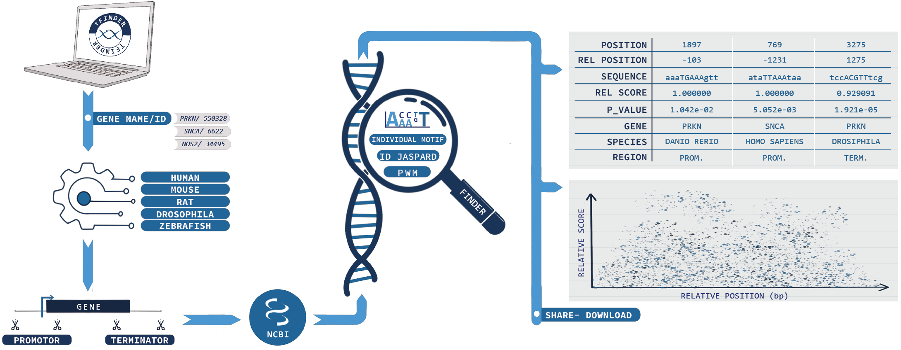

<picture>
    
</picture>

# TFinder 🧬🔍 

## Overview

TFinder is a Python easy-to-use web tool for identifying Transcription Factor Binding Sites (TFBS) and Individual Motif (IM). Using the NCBI API, it can easily extract either the promoter or terminal regions of a gene through a simple query of NCBI gene name or ID. It enables simultaneous analysis across five different species for an unlimited number of genes. The tool searches for TFBS and IM in different formats, including IUPAC codes and JASPAR entries. Moreover, TFinder also allows the generation and use of a Position Weight Matrix (PWM). Finally, the data may be recovered in a tabular form and a graph showing the relevance of the TFBSs and IMs as well as its location relative to the Transcription Start Site (TSS) or gene end. The results may be sent by email to the user facilitating the ulterior analysis and data sharing.

TFinder is written in Python and is freely available on GitHub under the MIT license: https://github.com/Jumitti/TFinder and can be accessed as a web application implemented in Streamlit at https://tfinder-ipmc.streamlit.app.

DOI: [https://doi.org/10.21203/rs.3.rs-3782387/v1](https://doi.org/10.21203/rs.3.rs-3782387/v1)

<picture>
    
</picture>

## Description
Transcription factors (TFs) are proteins that bind to DNA to regulate gene expression. They specifically recognize a nucleotide sequence called a transcription factor binding site (TFBS) in the promoter and terminator regions of genes. The search of these TFBSs is an empirical discipline in the field of genomics that concerns a key step before TFBS functional validation by gel shift assays (EMSA) and chromatin immunoprecipitation (ChIP) that allow the examination of the interaction between a TF and DNA (Jayaram, Usvyat and R. Martin 2016)

The in-silico research of TFBS can be tedious and time-consuming at various stages, especially for novices in the discipline. Thus, first, it is necessary to retrieve the promoter or terminator nucleotide sequence of a gene. This step may be achieved by the utilization of several databases such as NCBI, UCSC and Ensembl, but they are not intuitive and user-friendly. Next, after identifying the promoter sequence of interest, one may use TF databases such as JASPAR (Castro-Mondragon et al. 2022) and TRANSFAC (Matys 2006), but they have their limitations. For example, these platforms do not allow the search of TFBS from an unreferenced TF and may be subject to a fee. Other tools such as PROMO (Farre 2003), TFBIND (Tsunoda and Takagi 1999), TFsitescan make it possible to find all the TFs binding to a nucleotide sequence; nevertheless, they all use JASPAR and TRANSFAC databases and do not allow use of personal TF and their TFBS. Moreover, these tools are rather archaic and not very user-friendly. There is only MEME that allows research with of your “own” TFBS (Bailey et al. 2015). MEME has a large tool library but is a niche software suite. FIMO is their most similar tool to TFinder (Grant, Bailey and Noble 2011).

TFinder is an ultra-intuitive, easy-to-use and fast analysis open source and free tool that allows both the retrieval and search of TFBS in a unique site. TFinder allows the analysis of an unlimited number of genes; the selection of up to five different species (human, mouse, rat, drosophila, zebrafish); the choice and examination of either promoter or terminator gene regions; the configuration of an upstream downstream window of sequence analysis and the search of TFBS in different formats including IUPAC code, a JASPAR ID or a Position Weight Matrix. TFinder, searches for TFBS on the sense and antisense strand but also considers the search with the complementary forms. The software takes care of everything in record time.

## How to install/use

**No installation is required**. You can access it by clicking here 

A beta version of TFinder exists here. 

## Functions

### Browser compatibility

- Opera GX
- Chrome (also Chromium)
- Safari
- Edge
- Mozilla
- Phone

### Gene regulatory regions Extractor
- Extract mutliple regulatory regions (promoter/terminator) using ENTREZ_GENE_ID or NCBI Gene Name in FASTA format ([NCBI API](https://www.ncbi.nlm.nih.gov/home/develop/api/))
- Extract regions of sliced variant (NM, XM, NR, XR) and can extract all sliced variants from a gene name or ENTREZ_GENE_ID
- Species: Human 🙋🏼‍♂️, Mouse 🖱, Rat 🐀, Drosophila 🦟, Zebrafish 🐟
- Set Upstream and Downstream from Transcription Start Site (TSS) and Gene End

- Mode "Advance": allows to extract for the same gene the promoter and terminator regions for several species

### Individual Motif Finder
- Support multiple DNA sequences in FASTA format
- Find Individual Motif occurrences (like TFBS, enzymes restriction site, specific pattern... whatever you want)
- Support IUPAC code
- Generate PWM Individual Motif
- Support PWM transcription factor of JASPAR ([JASPAR API](https://jaspar.genereg.net/api/v1/docs/))
- Calculation of the distance of the found element to TSS or Gene End
- Relative Score calculation:

  

- p-value: 1000000 random sequences of reactive element length are generated based on the proportion of A, T, G, C in the analysed sequence. p-value is the number of random sequences generated having a relative score greater than or equal to the relative score of the element found divided by the number of random sequences generated

  

- Interactive graph
- Download results as excel (.xlsx)
- Export results via e-mail

## Working on...

- Cleaning code
- Fixing bug
- Improvements...

## More

Report an issue/bug 🆘 ➡️ [Click here](https://github.com/Jumitti/TFinder/issues/new/choose)

Want to talk ? 🙋🏼‍♂️ -> [Chat Room](https://github.com/Jumitti/TFinder/discussions)

Banner was generated with [Adobe Firefly](https://firefly.adobe.com/inspire/images)

Artwork made by [Minniti Pauline](https://minnitidesign.fr/)

## Credit & Licence & Citation

Copyright (c) 2023 Minniti Julien.

This software is distributed under an MIT licence. Please consult the LICENSE file for more details.

PREPRINT: [https://www.researchsquare.com/article/rs-3782387/v1](https://www.researchsquare.com/article/rs-3782387/v1)

